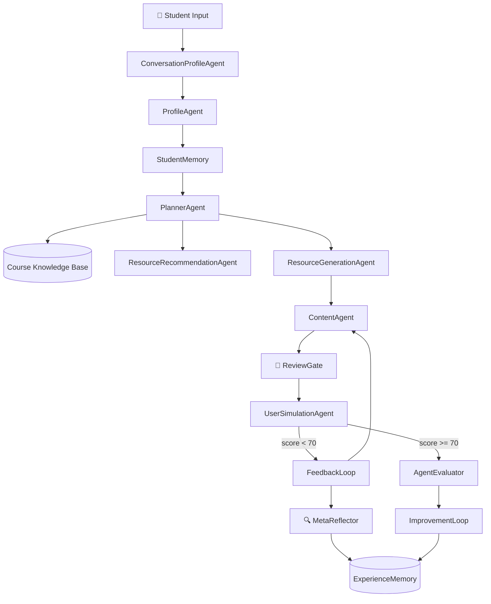
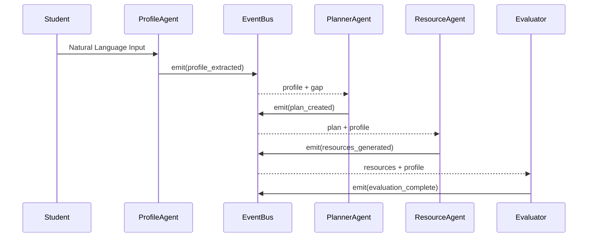

# A3 — System Architecture

> **12 Agents | EventBus | Memory Layer | Knowledge Base | Dashboard**

---

## System Overview

A3 is a research prototype exploring **multi-agent collaboration for personalized learning**. Instead of a single LLM, 12 specialized agents collaborate through shared memory and an EventBus to understand learners, generate personalized content, and continuously improve.

---

## 12-Agent Architecture



---

## Agent Communication Flow

Agents communicate through a **Singleton EventBus** — no direct coupling:



---

## Event-Driven Design

Every agent action is traced through EventBus:

| Event Type | Emitter | Content |
|:-----------|:--------|:--------|
| `profile_extracted` | ProfileAgent | 6-dim profile + confidence |
| `plan_created` | PlannerAgent | Nodes, strategies, minutes |
| `resources_generated` | ResourceGenerationAgent | 6 resource types |
| `evaluation_complete` | AgentEvaluator | 4-dim scores |
| `feedback_loop` | FeedbackLoop | Prompts refined |
| `experience_stored` | MetaReflector | Failure patterns |

Each event carries: `source_agent`, `action`, `input_summary`, `output_summary`, `duration_ms`, `status`.

---

## Memory Layer

```
┌─────────────────────────────────────────────┐
│              MemoryManager                    │
│                                               │
│  ┌─────────────────┐  ┌───────────────────┐  │
│  │ StudentMemory   │  │ ExperienceMemory  │  │
│  │                 │  │                   │  │
│  │ profile_history │  │ failure_patterns  │  │
│  │ weak_points     │  │ solutions         │  │
│  │ mastery_map     │  │ success_rate      │  │
│  │ (EMA α=0.5)    │  │ keywords          │  │
│  │ feedback_history│  │                   │  │
│  └────────┬────────┘  └────────┬──────────┘  │
│           │                    │              │
│           ▼                    ▼              │
│     storage/memory/     storage/memory/       │
│     students/<id>.json  experience/records.json│
└─────────────────────────────────────────────┘
```

**EMA Mastery Formula**: `new = old × 0.5 + recent_score × 0.5`

---

## Knowledge Base

```
knowledge_base/
└── artificial_intelligence_multi_agent_course/
    ├── course_intro.md          # Course overview
    ├── chapters/                # 6 chapters
    │   ├── chapter_01_ai_foundation.md
    │   ├── chapter_02_llm_architecture.md
    │   ├── chapter_03_prompt_engineering.md
    │   ├── chapter_04_rag_systems.md
    │   ├── chapter_05_agent_design.md
    │   └── chapter_06_evaluation.md
    ├── resources.json           # External references
    └── exercises.json           # 24 exercises
```

Loaded via `CourseKnowledgeBase` → bridges to `PlannerAgent` for knowledge-gap-driven planning.

---

## Streamlit Dashboard

6-panel observability dashboard:

| Panel | Content |
|:------|:--------|
| System Overview | 12-agent topology, active sessions |
| Student Intelligence | 6-dim profile, mastery heatmap |
| Execution Timeline | Agent trace with latencies |
| Decision Explainability | Reasons + evidence per decision |
| Agent Evaluation | 4-dim quality scores |
| Self Improvement | Failure → Reflect → Improve cycle |

---

## ReviewGate (3-Gate Content Safety)

```
Content → Gate 1: AST Static Check → Gate 2: Pytest Dynamic Validation → Gate 3: LLM Judge → Output
              ❌ Rejected                     ❌ Rejected                      ❌ Rejected
```

---

## Self-Improvement Loop

```
Agent Execute → Evaluate (4-dim) → score < threshold?
    YES → MetaReflector.analyze() → ExperienceMemory.store()
        → ImprovementLoop.suggest() → Re-execute with improved strategy
    NO  → Commit result
```

---

## Metrics

| Metric | Value |
|:-------|:------|
| Agents | 12 |
| Python LOC | 13,048 |
| Tests | 241/245 (97.4%) |
| Resource Types | 6 |
| Profile Dimensions | 6 |
| Knowledge Concepts | 46 |
